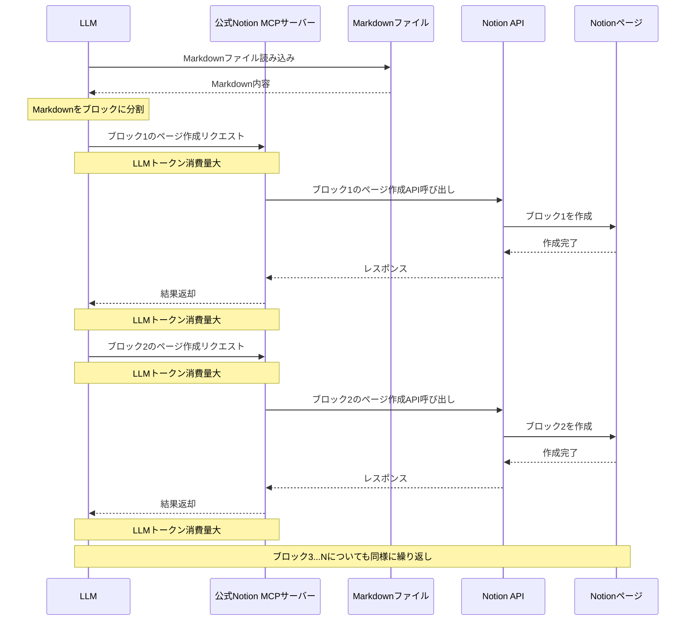
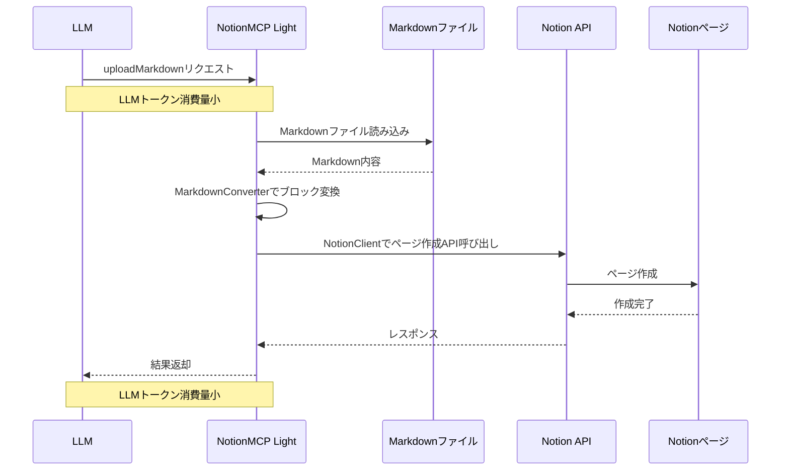

# 要件・設計書

## 1. 要件定義

### 1.1 基本情報
- ソフトウェア名称: NotionMCP Light
- リポジトリ名: notion-mcp-light

### 1.2 プロジェクト概要

本プロジェクトは、Notionの公式Model Context Protocol (MCP)サーバーが抱える非効率性（Markdownをブロック単位で読み書きし、LLMトークンを消費する点）を解決するために、トークンを使用せず、API経由で直接MarkdownファイルとNotionのページ／データベースを同期できる非公式のMCPサーバーを構築することを目的とする。

### 1.3 機能要件

#### 1.3.1 Markdown → Notion
- H1をページタイトルとして認識
- Markdownの内容をNotionページまたはデータベースのページとして作成
- データベースIDを指定可能
- Notion APIを直接使用（トークン未使用）

#### 1.3.2 Notion → Markdown
- 指定されたページまたはデータベースのページをMarkdown形式に変換
- タイトルをH1として出力
- ブロック構造をMarkdownに変換
- ファイルに保存

#### 1.3.3 MCPサーバー対応
- Model Context Protocol（MCP）に準拠
- CursorやClineなどのAIツールから呼び出し可能なエンドポイントを提供
- JSON-RPC over stdioベースで動作（予定）

### 1.4 非機能要件

- 迅速なレスポンス（LLMを使用しないため）
- ストリーム処理不要（非同期でなくても良い）
- シンプルな構成とメンテナンス性重視

### 1.5 制約条件

- Python 3.10以上で動作
- Notion API Tokenが必要
- Markdown構造に大きな自由度は持たせない（H1 = タイトル）

### 1.6 開発環境

- 言語: Python
- フレームワーク: FastAPI（または標準JSON-RPC）
- 外部ライブラリ:
  - `notion-sdk-py`
  - `python-sdk` (Model Context Protocol)
  - `markdown`, `mistune`（Markdown処理用）

### 1.7 成果物

- Python製MCPサーバースクリプト
- ドキュメント変換ユーティリティ
- README / 利用手順
- 設計書

## 2. システム設計

### 2.1 システム概要設計

#### 2.1.1 システムアーキテクチャ
```
[MCPクライアント(Cline, Cursor)] <-> [MCPサーバー (Python)] <-> [Notion API]
                                             |
                                  [Markdownファイル I/O]
```

#### 2.1.2 主要コンポーネント
- **MCPサーバー**
  - JSON-RPC over stdioをリッスン
  - Notionとの連携を管理
- **Notionクライアント**
  - APIラッパー
  - ページの作成・取得
- **Markdownコンバータ**
  - Markdown → Notionブロック変換
  - Notionブロック → Markdown変換

### 2.2 詳細設計

#### 2.2.1 クラス設計

##### `NotionClient`
```python
class NotionClient:
    def upload_markdown(filepath: str, database_id: Optional[str] = None, page_id: Optional[str] = None) -> str
    def download_page(page_id: str, output_path: str) -> None
```

##### `MarkdownConverter`
```python
class MarkdownConverter:
    def parse_markdown_to_blocks(md: str) -> List[dict]
    def convert_blocks_to_markdown(blocks: List[dict]) -> str
```

##### `MCPServer`
```python
class MCPServer:
    def handle_upload_markdown(request) -> Response
    def handle_download_markdown(request) -> Response
```

### 2.3 インターフェース設計

- JSON-RPCエンドポイント:
  - `uploadMarkdown`: Markdownファイル → Notion
  - `downloadMarkdown`: Notionページ → Markdownファイル

### 2.4 セキュリティ設計

- Notion APIトークンは環境変数で管理（`.env`）
- 外部からの直接アクセスは制限（ローカル環境前提）

### 2.5 テスト設計

- 単体テスト
  - Markdown変換の正確性
  - Notion APIの応答確認
- 統合テスト
  - 実ファイルを使用した変換テスト
  - MCPリクエストを模擬した動作確認

### 2.6 開発環境・依存関係

- Python 3.10+
- `notion-client`
- `python-sdk`（MCP）
- `markdown`, `mistune`, `dotenv`

### 2.7 開発工程

| フェーズ | 内容 | 期間 |
|---------|------|------|
| 要件定義 | 本仕様書作成 | 第1週 |
| 設計 | アーキテクチャ・モジュール設計 | 第1週 |
| 実装 | 各モジュールの開発 | 第2-3週 |
| テスト | 単体・統合テスト | 第4週 |
| リリース | ドキュメント整備・デプロイ対応 | 第5週 |

## 3. Notion MCPサーバー比較

### 3.1 公式Notion MCPサーバーのシーケンス図（Markdown→Notion書き込み）





### 3.2 NotionMCP Lightのシーケンス図（Markdown→Notion書き込み）





### 3.3 主な違い

1. **LLMトークン消費**:
   - 公式MCPサーバー: ブロックごとに処理するため、LLMトークン消費量が大きい
   - NotionMCP Light: 一括処理のため、LLMトークン消費量が小さい

2. **処理方法**:
   - 公式MCPサーバー: LLMがMarkdownを読み込み、ブロック単位で何度もAPIを呼び出す
   - NotionMCP Light: MCPサーバーがMarkdownファイル全体を一括処理

3. **効率性**:
   - 公式MCPサーバー: ブロックごとの処理によりトークン消費が多く、API呼び出しも複数回
   - NotionMCP Light: ファイル操作による直接同期で効率的、API呼び出しは1回

4. **データフロー**:
   - 公式MCPサーバー: LLM→Markdownファイル→LLM→MCP→Notion API（ブロックごとに繰り返し）
   - NotionMCP Light: LLM→MCP→Markdownファイル→Notion API（一括処理）

## 3. Notion MCPサーバー比較

### 3.1 公式Notion MCPサーバーのシーケンス図（Markdown→Notion書き込み）


### 3.2 NotionMCP Lightのシーケンス図（Markdown→Notion書き込み）


### 3.3 主な違い

1. **LLMトークン消費**:
   - 公式MCPサーバー: ブロックごとに処理するため、LLMトークン消費量が大きい
   - NotionMCP Light: 一括処理のため、LLMトークン消費量が小さい

2. **処理方法**:
   - 公式MCPサーバー: LLMがMarkdownを読み込み、ブロック単位で何度もAPIを呼び出す
   - NotionMCP Light: MCPサーバーがMarkdownファイル全体を一括処理

3. **効率性**:
   - 公式MCPサーバー: ブロックごとの処理によりトークン消費が多く、API呼び出しも複数回
   - NotionMCP Light: ファイル操作による直接同期で効率的、API呼び出しは1回

4. **データフロー**:
   - 公式MCPサーバー: LLM→Markdownファイル→LLM→MCP→Notion API（ブロックごとに繰り返し）
   - NotionMCP Light: LLM→MCP→Markdownファイル→Notion API（一括処理）
